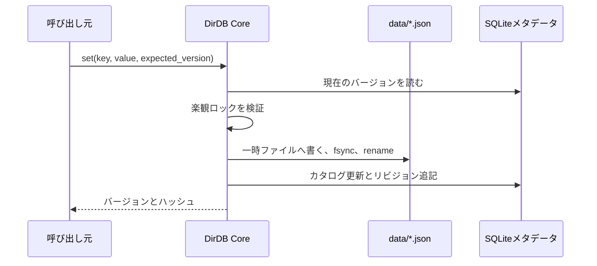
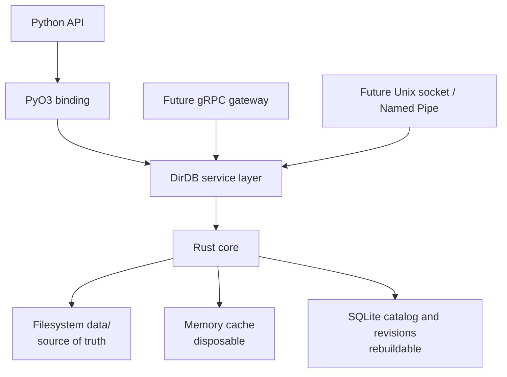
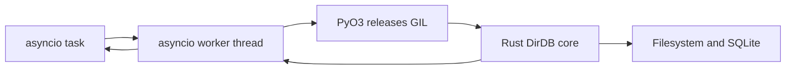
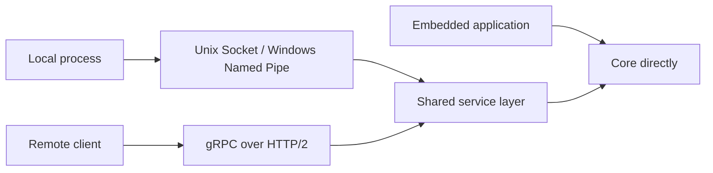

# DirDB 仕様書・設計書

## アイデンティティ

| 項目 | 定義 |
| --- | --- |
| 名称 | `DirDB` |
| 読み | Deer DB / Directory DB（ディアDB／ディレクトリDB） |
| 意味 | `Dir`ectory、*deer*（鹿）、*dear*（親愛なる・大切な） |
| タグライン | **Your directory is the database.** |
| 対象 | ファイルシステムを優先するローカル設定ストア |

## 基本原則

1. 通常運用での唯一の正本は `data/` 内のファイルです。
2. メモリは破棄可能なキャッシュ、SQLiteは再構築可能なカタログと復旧履歴です。
3. 復旧は明示的な管理者操作であり、正本を自動的に切り替えません。
4. コアはRustで実装し、Pythonは小さく使いやすいAPIだけを公開します。
5. 通信機能はコアに含めず、将来は別のサーバーレイヤーとして提供します。

## v0.1 データモデル

論理キー1件はJSONドキュメント1件に対応します。`services/auth/config` は `data/services/auth/config.json` です。

```text
state/
├── data/                 正本のドキュメント
├── metadata.db           SQLiteカタログとリビジョン
└── snapshots/            将来の論理スナップショット
```

SQLiteにはキー、単調増加するバージョン、ハッシュ、時刻、変更不能なリビジョン内容を保存します。`metadata.db` を失っても、`rebuild_index()` が正本のファイルを走査してカタログを再作成します。

## 通常の書き込みフロー



書き込み中に中断しても、完了済みのドキュメントを一時ファイルが置き換えてはいけません。将来のプラットフォーム層では、特にWindowsでの置換セマンティクスとプロセス間ロックを強化します。

## アーキテクチャ



## 公開API

```python
db = DirDB("./state")
db.get("system/config")
db.set("system/config", {"mode": "safe"}, expected_version=3)
db.delete("system/config", expected_version=4)
db.exists("system/config")
db.list("system")
db.rebuild_index()
```

`expected_version` により更新競合を検出します。現在のバージョンと一致しない更新は競合エラーとして失敗します。

## Pythonの並行実行モデル

サーバー利用ではPython APIをasync-firstとします。スクリプト向けの同期メソッドに加え、`asyncio`アプリケーション向けに`aget`、`aset`、`adelete`、`aexists`、`alist`、`arebuild_index`を公開します。各非同期呼び出しはワーカースレッドでネイティブ処理を実行し、PyO3層はファイル／SQLite処理中にGILを解放します。コアはSQLite接続へのアクセスを直列化しつつ、Pythonのイベントループは他の処理を継続できます。



## ビルドとリリース

`uv build` はmaturinを通じてソース配布物とwheelを生成します。`.github/workflows/ci.yml` はRustフォーマットとClippy、Ruff検査／フォーマット、Rust／Pythonテスト、Linux・macOS・Windows向けwheelビルドを実行します。`main`へのpushが成功すると、設定バージョンがPyPIに存在するかを確認し、新しいバージョンではGitHub Releaseを作成してテスト済み配布物を公開します。

公開にはGitHub OIDCのTrusted Publishingを使います。PyPIプロジェクト名は[`DirDB-Rust`](https://pypi.org/project/DirDB-Rust/)ですが、Pythonからのimportは引き続き`from dirdb import DirDB`です。

## 将来の転送最適化

ローカルコア自身はネットワーク経由でデータ転送をしません。将来のサーバーレイヤーでは、エントリの`version`、内容ハッシュ、変更パスを通常の転送単位にします。クライアントが同一バージョンまたはハッシュを持つ場合は`not_modified`を返し、Watchイベントは通常、パス、操作、バージョン、ハッシュだけを持ちます。ドキュメント本体はキャッシュミス、明示的な取得、または小さい値をイベントへ含める閾値を超えない場合だけ送ります。低レベルの通信プロトコルを追加する前に、バッチ操作と変更シーケンスで往復回数を減らします。

## 復旧設計

復旧はdry-runを標準にした計画／適用APIで提供します。

```python
plan = db.plan_restore(source="sqlite_revision", revision="latest")
db.apply_restore(plan)
```

将来の適用フローは、メンテナンスモードへの移行、現行ファイルの退避、復旧元ハッシュの検証、ステージングツリーへの展開と検証、原子的な切り替え、キャッシュ無効化、メタデータ再構築です。`merge` は追加・更新のみ、`mirror` は復旧元にない項目も削除します。

## プロセス／ネットワークモード



最初のリリースは埋め込み／ローカル専用です。将来は別OSSのサーバーが、Protocol Buffersを使うHTTP/2上のgRPC、長時間接続、`BatchGet`、`BatchSet`、compare-and-set、ストリーミング`Watch`を提供できます。想定環境は安定したLAN、VPC、データセンター回線のため、QUICを開始条件にはしません。

## ロードマップ

| 段階 | 成果物 |
| --- | --- |
| 0.1 | JSON、原子的書き込み、カタログ／履歴、バージョン検査、Rustテスト、Pythonバインディング |
| 0.2 | 上限付きキャッシュ、ファイル監視、パス単位のプロセス間ロック、CLI |
| 0.3 | スナップショット、計画／適用型の復旧、メンテナンスモード |
| 0.4 | ローカルIPCアダプター |
| 別OSS | gRPCサーバー／クライアント、認証、TLS、バッチ、Watchストリーム |

English version: [design.md](design.md)
