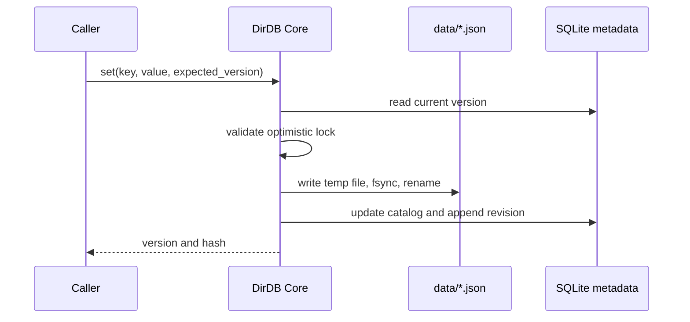
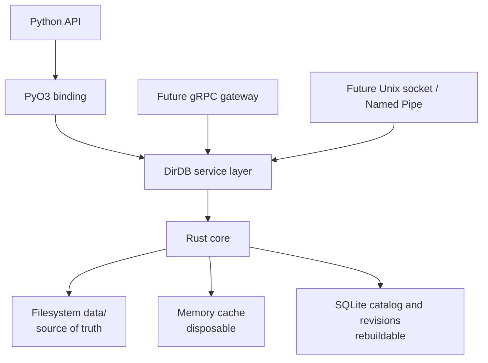
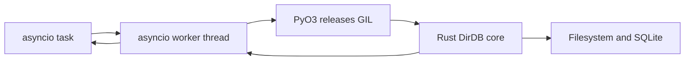
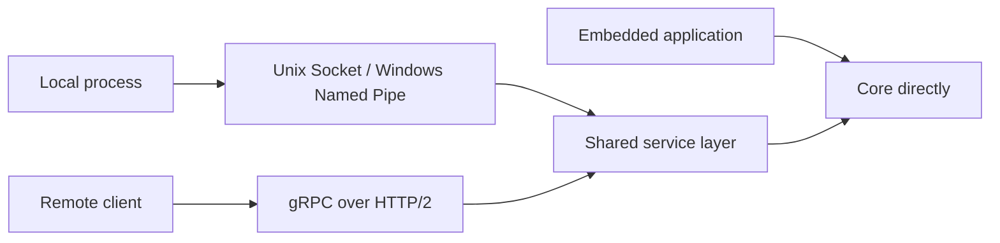

# DirDB Specification and Design

## Identity

| Item | Definition |
| --- | --- |
| Name | `DirDB` |
| Reading | Deer DB / Directory DB (Japanese: ディアDB / ディレクトリDB) |
| Meaning | `Dir`ectory, *deer*, and *dear* |
| Tagline | **Your directory is the database.** |
| Scope | A local, filesystem-first configuration store |

## Principles

1. `data/` files are the only normal-operation source of truth.
2. Memory is disposable cache; SQLite is rebuildable catalog and recovery history.
3. Recovery is an explicit administrator operation, never an automatic change of authority.
4. The core is Rust; Python exposes a deliberately small ergonomic API.
5. Networking is out of the core. It belongs in a future, separately deployable server layer.

## v0.1 Data Model

One logical key maps to one JSON document. `services/auth/config` maps to `data/services/auth/config.json`.

```text
state/
├── data/                 authoritative documents
├── metadata.db           SQLite catalog + revisions
└── snapshots/            future logical snapshots
```

SQLite stores the document key, monotonically increasing version, hash, timestamp, and immutable revision contents. If `metadata.db` is lost, `rebuild_index()` scans the authoritative files and recreates the catalog.

## Normal Write Flow



An interrupted write can leave a temporary file, but it must not replace the last completed document. A future platform-specific layer will strengthen replacement semantics and cross-process locking, especially on Windows.

## Architecture



## Public API

```python
db = DirDB("./state")
db.get("system/config")
db.set("system/config", {"mode": "safe"}, expected_version=3)
db.delete("system/config", expected_version=4)
db.exists("system/config")
db.list("system")
db.rebuild_index()
```

`expected_version` prevents lost updates. A mismatch fails with a version-conflict error.

## Python Concurrency Model

Python is async-first for server use. The public package exposes synchronous methods for scripts and `aget`, `aset`, `adelete`, `aexists`, `alist`, and `arebuild_index` for `asyncio` applications. Each async call runs the native operation in a worker thread; the PyO3 layer releases the GIL around filesystem and SQLite work. The core serializes SQLite connection access while allowing the Python event loop to keep serving unrelated work.



## Build and Release

`uv build` produces source and wheel distributions through maturin. `.github/workflows/release.yml` runs workspace tests and creates wheel artifacts for Linux, macOS, and Windows on pull requests, manual runs, and `v*` tags.

## Recovery Design

Recovery will use plan/apply APIs, with dry-run as the default:

```python
plan = db.plan_restore(source="sqlite_revision", revision="latest")
db.apply_restore(plan)
```

The future apply flow is: enter maintenance mode, back up current files, verify source hashes, materialize a staging tree, verify it, atomically switch it in, invalidate cache, then rebuild metadata. `merge` will only add/update; `mirror` will additionally remove entries absent from the recovery source.

## Process and Network Modes



The first release is embedded/local only. A separate server OSS may later provide gRPC over HTTP/2 with Protocol Buffers, long-lived channels, `BatchGet`, `BatchSet`, compare-and-set, and streaming `Watch`. QUIC is intentionally not a starting requirement: expected deployments are stable LAN, VPC, or datacenter links where HTTP/2 tooling and operations are a better fit.

## Roadmap

| Phase | Deliverable |
| --- | --- |
| 0.1 | JSON documents, atomic writes, catalog/revisions, version checks, Rust tests, Python binding |
| 0.2 | Bounded cache, file watching, path-level cross-process lock, CLI |
| 0.3 | Snapshot and plan/apply recovery, maintenance mode |
| 0.4 | Local IPC adapter |
| Separate OSS | gRPC server/client, authentication, TLS, batching, watch streams |
