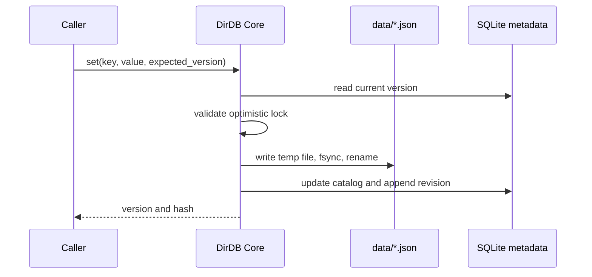
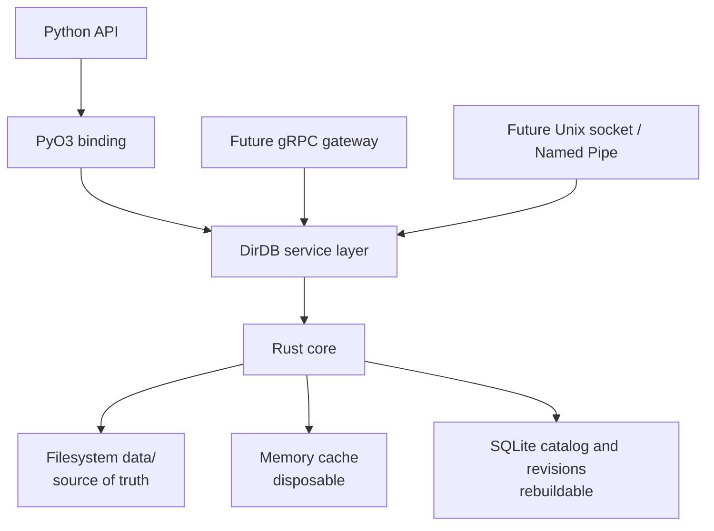
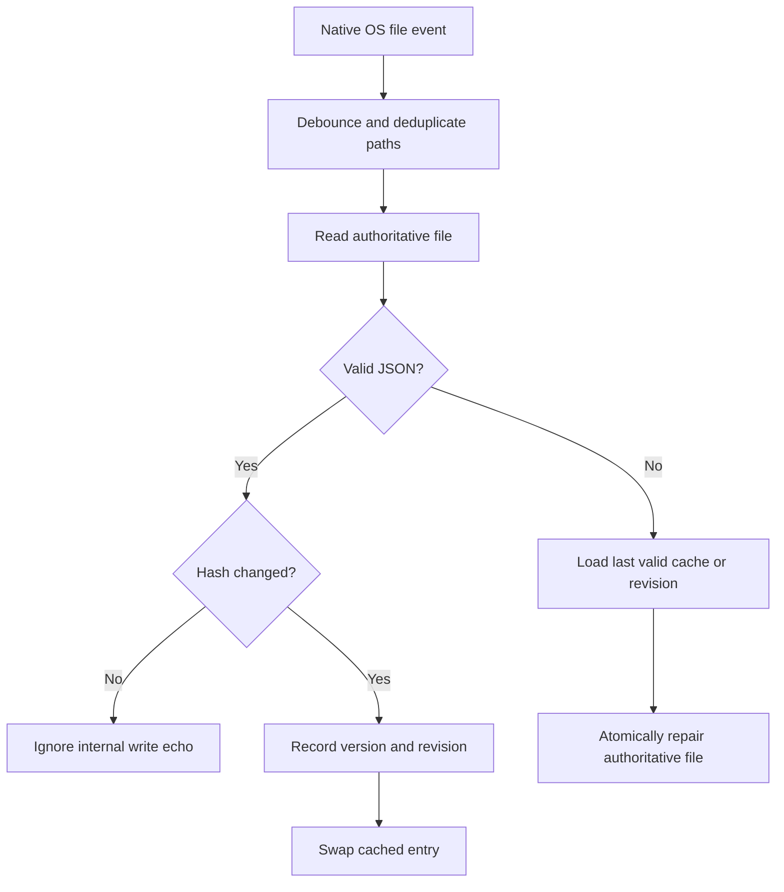
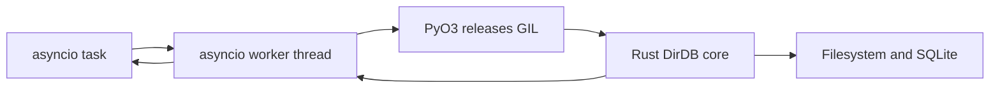
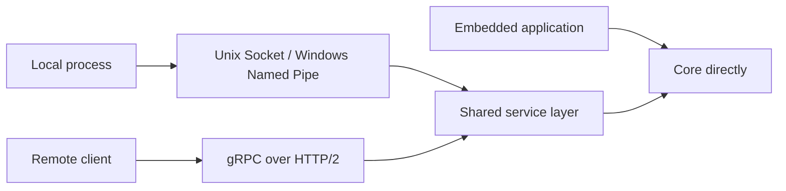

# DirDB Specification and Design

## Identity

| Item | Definition |
| --- | --- |
| Name | `DirDB` |
| Reading | Deer DB / Directory DB (Japanese: ディアDB / ディレクトリDB) |
| Meaning | `Dir`ectory, *deer*, and *dear* |
| Tagline | **Your directory is the database.** |
| Scope | A local, filesystem-first configuration store |

## Principles

1. `data/` files are the only normal-operation source of truth.
2. Memory is disposable cache; SQLite is rebuildable catalog and recovery history.
3. Recovery is an explicit administrator operation, never an automatic change of authority.
4. The core is Rust; Python exposes a deliberately small ergonomic API.
5. Networking is out of the core. It belongs in a future, separately deployable server layer.

## v0.2 Data Model

One logical key maps to one JSON document. `services/auth/config` maps to `data/services/auth/config.json`.

```text
state/
├── data/                 authoritative documents
├── metadata.db           SQLite catalog + revisions
└── snapshots/            future logical snapshots
```

SQLite stores the document key, monotonically increasing version, hash, timestamp, and immutable revision contents. If `metadata.db` is lost, `rebuild_index()` scans the authoritative files and recreates the catalog. When it finds a valid file whose bytes differ from the latest revision, it records that file as the next revision rather than reverting the file or reusing an old hash.

## Normal Write Flow



An interrupted write can leave a temporary file, but it must not replace the last completed document. A future platform-specific layer will strengthen replacement semantics and cross-process locking, especially on Windows.

## Architecture



## Public API

```python
db = DirDB("./state")
db.get("system/config")
db.set("system/config", {"mode": "safe"}, expected_version=3)
db.delete("system/config", expected_version=4)
db.exists("system/config")
db.list("system")
db.rebuild_index()
```

The Rust core maintains a bounded LRU cache and, by default, a native OS file
watcher. Python reads do not poll the filesystem on a cache hit.

```python
db = DirDB("./state", cache_max_items=10_000, auto_reload=True, debounce_ms=100)
print(db.cache_stats())
print(db.stat("system/config"))
```

## Automatic Reload and Repair



OS notifications are hints, not trusted contents. Rust re-reads and validates
the file after the debounce window. A valid external edit increments the
version and replaces the cached document. Invalid JSON never enters the cache:
DirDB atomically restores the last valid cached value, or the latest valid
SQLite revision when the cache is cold. With no valid history, `stat()` reports
the reload error.

Native notifications are backed by a configurable integrity verifier. It first
compares file modification time and size, then hashes and reloads only changed
candidates. `auto_reload=False` disables all background work.

## Batch Operations

`get_many()` and `set_many()` cross the Python/Rust boundary once. Batch writes
retain atomic replacement per document and commit all resulting SQLite metadata
in one transaction. They preserve input order but are not an all-or-nothing
filesystem transaction.

```python
await db.aset_many({"app/a": {"enabled": True}, "app/b": {"enabled": False}})
values = await db.aget_many(["app/a", "app/b"])
```

## Process Model

The local core guarantees multiple readers and one writer process. It does not
create lock files on the data path. Applications needing multiple remote
writers should serialize writes in the future IPC/gRPC service layer.

`expected_version` prevents lost updates. A mismatch fails with a version-conflict error.

## Python Concurrency Model

Python is async-first for server use. The public package exposes synchronous methods for scripts and `aget`, `aset`, `adelete`, `aexists`, `alist`, and `arebuild_index` for `asyncio` applications. Each async call runs the native operation in a worker thread; the PyO3 layer releases the GIL around filesystem and SQLite work. The core serializes SQLite connection access while allowing the Python event loop to keep serving unrelated work.



## Build and Release

`uv build` produces source and wheel distributions through maturin. `.github/workflows/ci.yml` checks Rust formatting and Clippy, Ruff checks and formatting, Rust/Python tests, and builds wheels for Linux, macOS, and Windows. A successful push to `main` checks whether the configured version exists on PyPI; a new version automatically creates a GitHub Release and publishes the tested artifacts.

Publication uses GitHub OIDC Trusted Publishing. The PyPI project is [`DirDB-Rust`](https://pypi.org/project/DirDB-Rust/), while Python imports remain `from dirdb import DirDB`.

## Future Transfer Optimization

The local core does not transfer data across a network. A future server layer should use the entry `version`, content hash, and changed path as its normal transfer unit. A client that already has the same version or hash receives `not_modified`; watch events normally carry only path, operation, version, and hash. Full document bytes are sent only on a cache miss, explicit fetch, or when a small-value threshold permits inline payloads. Batch operations and change sequences should reduce round trips before introducing a lower-level protocol.

## Recovery Design

Recovery will use plan/apply APIs, with dry-run as the default:

```python
plan = db.plan_restore(source="sqlite_revision", revision="latest")
db.apply_restore(plan)
```

The future apply flow is: enter maintenance mode, back up current files, verify source hashes, materialize a staging tree, verify it, atomically switch it in, invalidate cache, then rebuild metadata. `merge` will only add/update; `mirror` will additionally remove entries absent from the recovery source.

## Process and Network Modes



The first release is embedded/local only. A separate server OSS may later provide gRPC over HTTP/2 with Protocol Buffers, long-lived channels, `BatchGet`, `BatchSet`, compare-and-set, and streaming `Watch`. QUIC is intentionally not a starting requirement: expected deployments are stable LAN, VPC, or datacenter links where HTTP/2 tooling and operations are a better fit.

## Roadmap

| Phase | Deliverable |
| --- | --- |
| 0.1 | JSON documents, atomic writes, catalog/revisions, version checks, Rust tests, Python binding |
| 0.2 | Bounded cache, native watching, integrity verification, invalid-edit repair, native batch API, CLI |
| 0.3 | Snapshot and plan/apply recovery, maintenance mode |
| 0.4 | Local IPC adapter |
| Separate OSS | gRPC server/client, authentication, TLS, batching, watch streams |
